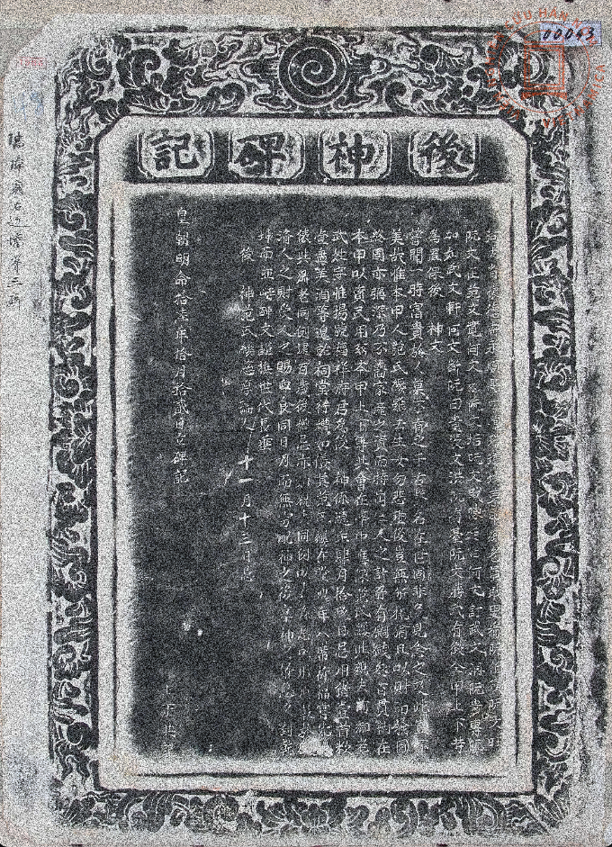
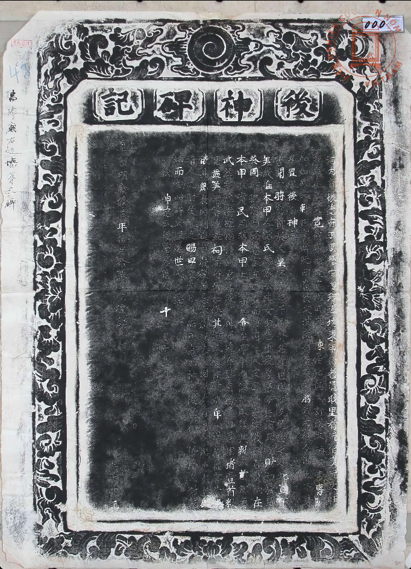

# Augmentation (17 variations possibles)
# OPENCV Only

## Flip (rotate sur l'axe des Y)

```python
import cv2
image = cv2.imread('../ImageSteles/00043.jpg')
# Check if the image was successfully loaded
if image is None:
    print("Error: Could not load the image.")
else:
    # Reverse the image horizontally
    reversed_image = cv2.flip(image, 1)

    
    cv2.imshow('Reversed Image', reversed_image)
    cv2.waitKey(0)
    cv2.destroyAllWindows()
```


On peut également modifier le fichier json correspondant pour que les masques suivent : 

```python
import json
import cv2

# Load the image
image_path = 'path_to_your_image.jpg'  # Replace with your image path
image = cv2.imread(image_path)

# Load the COCO JSON file
coco_json_path = 'path_to_your_coco_json.json'  # Replace with your COCO JSON path
with open(coco_json_path, 'r') as f:
    coco_data = json.load(f)

# Get image dimensions
height, width, _ = image.shape

# Reverse the image horizontally
reversed_image = cv2.flip(image, 1)

# Update bounding boxes and segmentations in the COCO JSON data
for annotation in coco_data['annotations']:
    # Update bounding box: [x, y, width, height]
    bbox = annotation['bbox']
    x, y, w, h = bbox
    new_x = width - x - w
    annotation['bbox'] = [new_x, y, w, h]

    # Update segmentation points
    if 'segmentation' in annotation:
        new_segmentation = []
        for seg in annotation['segmentation']:
            new_seg = []
            for i in range(0, len(seg), 2):
                new_seg.append(width - seg[i])
                new_seg.append(seg[i + 1])
            new_segmentation.append(new_seg)
        annotation['segmentation'] = new_segmentation

# Save the updated COCO JSON file
updated_coco_json_path = 'path_to_your_updated_coco_json.json'  # Replace with your desired output path
with open(updated_coco_json_path, 'w') as f:
    json.dump(coco_data, f, indent=4)

# Display the reversed image (for verification)
cv2.imshow('Reversed Image', reversed_image)
cv2.waitKey(0)
cv2.destroyAllWindows()

```

## Inverser 


```python
import cv2

image = cv2.imread('../ImageSteles/00043.jpg')

if image is None:
    print("Error: Could not load the image.")
else:
    # Inverse the image colors
    inverted_image = cv2.bitwise_not(image)

    cv2.imshow('Inverted Image', inverted_image)

    # Wait for a key press and close the image windows
    cv2.waitKey(0)
    cv2.destroyAllWindows()
```


# AUGRAPHY 

## Instal

```bash
pip install augraphy
```

## Brightness

```python
import cv2
import numpy as np
from augraphy import *


image = cv2.imread('../ImageSteles/00043.jpg')

brightness_dimmer= Brightness(brightness_range=(0.7, 0.8),
                                min_brightness=1,
                                min_brightness_value=(120, 150),
                        )

img_brightness_dimmer= brightness_dimmer(image)
cv2.imshow("brightness_dimmer", img_brightness_dimmer)
cv2.waitKey(0)
cv2.destroyAllWindows()
```

## Brightness Texturize

```python

import cv2
import numpy as np
from augraphy import *


image = cv2.imread('../ImageSteles/00043.jpg')


brightness_texturize = BrightnessTexturize(texturize_range=(0.9, 0.99),
                                           deviation=0.5)

img_brightness_texturize = brightness_texturize(image)
cv2.imshow("brightness_texturize", img_brightness_texturize)
cv2.waitKey(0)
cv2.destroyAllWindows()


```


## Color Paper

```python

import cv2
import numpy as np
from augraphy import *


image = cv2.imread('../ImageSteles/00043.jpg')


colorpaper= ColorPaper(hue_range=(0, 20), saturation_range=(10,50))

img_colorpaper = colorpaper(image)
cv2.imshow("colorpaper", img_colorpaper)

cv2.waitKey(0)
cv2.destroyAllWindows()


```

## Color Shit (Blur)

```python

import cv2
import numpy as np
from augraphy import *


image = cv2.imread('../ImageSteles/00043.jpg')


colorshift = ColorShift(color_shift_offset_x_range = (3,9),
                        color_shift_offset_y_range = (3,9),
                        color_shift_iterations = (2,9),
                        color_shift_brightness_range = (0.9,1.1),
                        color_shift_gaussian_kernel_range = (3,3),
                        )

img_colorshift = colorshift(image)
cv2.imshow("colorshift", img_colorshift)
cv2.waitKey(0)
cv2.destroyAllWindows()

```

## DelaunayTessellation

```python

import cv2
import numpy as np
from augraphy import *


image = cv2.imread('../ImageSteles/00043.jpg')


delaunay_pattern = DelaunayTessellation(
                                        n_points_range = (500, 800),
                                        n_horizontal_points_range=(50, 100),
                                        n_vertical_points_range=(50, 100),
                                        noise_type = "random")

img_final = delaunay_pattern(image)
cv2.imshow("Delaunay Image", img_final)
cv2.waitKey(0)
cv2.destroyAllWindows()

```


## DirtyDrum - Add Noise 

```python

import cv2
import numpy as np
from augraphy import *


image = cv2.imread('../ImageSteles/00043.jpg')


dirtydrum3 = DirtyDrum(line_width_range=(2, 5),
                      line_concentration=0.3,
                      direction=2,
                      noise_intensity=0.2,
                      noise_value=(0, 5),
                      ksize=(3, 3),
                      sigmaX=0,
                      )

img_dirtydrum3 = dirtydrum3(image)
cv2.imshow("dirtydrum3", img_dirtydrum3)

cv2.waitKey(0)
cv2.destroyAllWindows()
```


## DirtyRollers - Add Noise (Bandes Hozirontales)

```python

import cv2
import numpy as np
from augraphy import *


image = cv2.imread('../ImageSteles/00043.jpg')

dirty_rollers = DirtyRollers(line_width_range=(17, 35),
                            scanline_type=0,
                            )

img_dirty_rollers = dirty_rollers(image)
cv2.imshow("dirty_rollers", img_dirty_rollers)

cv2.waitKey(0)
cv2.destroyAllWindows()

```


## Dithering - Add Noise (Old school TV)

```python

import cv2
import numpy as np
from augraphy import *


image = cv2.imread('../ImageSteles/00043.jpg')

dirther_floyd = Dithering(dither="floyd" )

img_dither_floyd = dirther_floyd(image)
cv2.imshow("dither_floyd", img_dither_floyd)

cv2.waitKey(0)
cv2.destroyAllWindows()

```
a
## Faxify

```python

import cv2
import numpy as np
from augraphy import *


image = cv2.imread('../ImageSteles/00043.jpg')

faxify = Faxify(scale_range = (1,2),
                monochrome = 1,
                monochrome_method = "cv2.threshold",
                monochrome_arguments = {"thresh":170, "maxval":170, "type":cv2.THRESH_BINARY},
                halftone = 1,
                invert = 1,
                half_kernel_size = (2,2),
                angle = (0, 360),
                sigma = (1,3))

img_faxify = faxify(image)
cv2.imshow("faxify", img_faxify)

cv2.waitKey(0)
cv2.destroyAllWindows()

```


## Hollow

```python

import cv2
import numpy as np
from augraphy import *


image = cv2.imread('../ImageSteles/00043.jpg')

hollow = Hollow(hollow_median_kernel_value_range = (180, 180),
                hollow_min_width_range=(1, 1),
                hollow_max_width_range=(200, 200),
                hollow_min_height_range=(1, 1),
                hollow_max_height_range=(200, 200),
                hollow_min_area_range=(10, 10),
                hollow_max_area_range=(2000, 2000),
                hollow_dilation_kernel_size_range = (3, 3),
                )

img_hollow= hollow(image)
cv2.imshow("hollow", img_hollow)


cv2.waitKey(0)
cv2.destroyAllWindows()

```


## Lighting - low 

```python

import cv2
import numpy as np
from augraphy import *


image = cv2.imread('../ImageSteles/00043.jpg')

lighting_gradient_gaussian = LightingGradient(light_position=None,
                                              direction=90,
                                              max_brightness=255,
                                              min_brightness=0,
                                              mode="gaussian",
                                              transparency=0.5
                                              )

img_lighting_gradient_gaussian = lighting_gradient_gaussian(image)
cv2.imshow("lighting_gradient_gaussian", img_lighting_gradient_gaussian)


cv2.waitKey(0)
cv2.destroyAllWindows()

```

## Lighting - HIGH 

```python
import cv2
import numpy as np
from augraphy import *


image = cv2.imread('../ImageSteles/00043.jpg')

lighting_gradient_linear_static = LightingGradient(light_position=None,
                                              direction=45,
                                              max_brightness=255,
                                              min_brightness=0,
                                              mode="linear_static",
                                              linear_decay_rate = 0.5,
                                              transparency=0.5
                                              )

img_lighting_gradient_linear_static= lighting_gradient_linear_static(image)
cv2.imshow("lighting_gradient_linear_static", img_lighting_gradient_linear_static)

cv2.waitKey(0)
cv2.destroyAllWindows()

```


## LowLightNoise

```python
import cv2
import numpy as np
from augraphy import *


image = cv2.imread('../ImageSteles/00043.jpg')

lowlightnoise_obj = LowLightNoise(
    num_photons_range = (50, 100),
    alpha_range = (0.7, 0.9),
    beta_range = (10, 30),
    gamma_range = (1.0 , 1.8)
)

lowlightnoise_img = lowlightnoise_obj(image)
cv2.imshow("LowLightNoise Augmentation", lowlightnoise_img)

cv2.waitKey(0)
cv2.destroyAllWindows()

```


## PatternGenerator

```python
import cv2
import numpy as np
from augraphy import *


image = cv2.imread('../ImageSteles/00043.jpg')

quasi_pattern = PatternGenerator(
    imgx = 512,
    imgy= 512,
    n_rotation_range = (10,15)
)

img_final = quasi_pattern(image)
cv2.imshow("Image", img_final)

cv2.waitKey(0)
cv2.destroyAllWindows()


```


## Shadow

```python
import cv2
import numpy as np
from augraphy import *


image = cv2.imread('../ImageSteles/00043.jpg')

shadowcast = ShadowCast(shadow_side = "bottom",
                        shadow_vertices_range = (2, 3),
                        shadow_width_range=(0.5, 0.8),
                        shadow_height_range=(0.5, 0.8),
                        shadow_color = (0, 0, 0),
                        shadow_opacity_range=(0.5,0.6),
                        shadow_iterations_range = (1,2),
                        shadow_blur_kernel_range = (101, 301),
                        )

img_shadowcast = shadowcast(image)
cv2.imshow("shadowcast", img_shadowcast)

cv2.waitKey(0)
cv2.destroyAllWindows()
```

